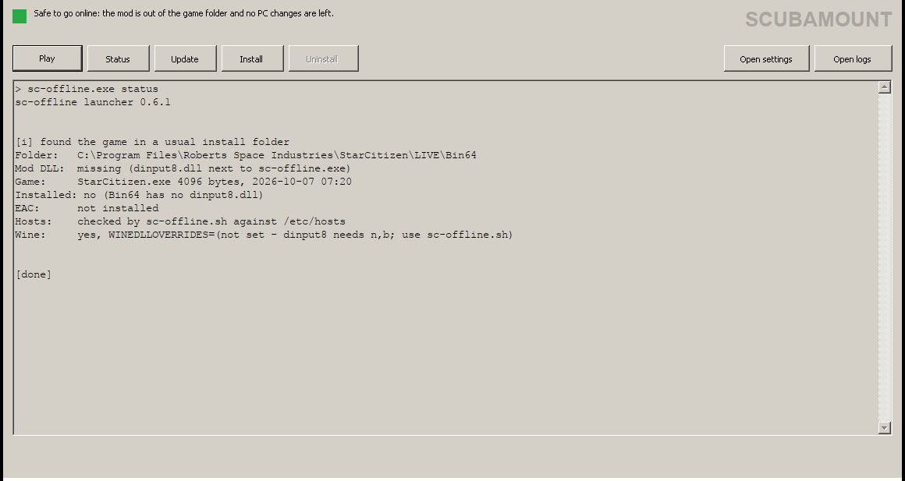

## [👉 Join the Discord 👈](https://discord.gg/NJKeVfYCCC)

# sc-offline

**An offline, single-player mod menu for Star Citizen.** 
Spawn ships, NPCs and buildings, travel the star systems and wear Squadron 42 outfits, all from one in-game menu.

-555?style=flat-square)

[**Download**](https://github.com/scubamount/sc-offline/releases/latest) ·
[**Discord**](https://discord.gg/NJKeVfYCCC) ·
[Setup](#setup) ·
[Play](#play) ·
[Troubleshooting](#troubleshooting) ·
[Go back online](#go-back-online) ·
[Docs](#more-docs)

> [!WARNING]
> This mod may get your account banned. Use it at your own risk, and **only offline**, never on Cloud Imperium Games' servers.

> [!NOTE]
> **Played in game on Windows with 0.6.1** (October 2026): the launcher, the menu and its features worked. Since then sc-offline was converted to run on sco-core's game services and its cheats became an optional plugin, and **none of that conversion has been run in game yet** ([what is not verified](docs/status.md)). Other PCs and game patches can still behave differently; known problems are tracked in [Issues](https://github.com/scubamount/sc-offline/issues). If something breaks, see [Troubleshooting](#troubleshooting) and [report it](https://github.com/scubamount/sc-offline/issues). Linux through Wine is still untested.

## Quick start

1. **Download** `sc-offline-<version>.zip` from the [latest release](https://github.com/scubamount/sc-offline/releases/latest) and extract it anywhere.
2. **Close** the RSI Launcher and the game.
3. **Open** `sc-offline.exe`, click **Play**, and say yes to the administrator prompt.
4. **Press `M`** once the game has loaded you in.

The launcher puts the mod into your game folder while you play and takes it out again afterwards, along with every change it made to your PC.

## What you need

| Requirement | Details |
| --- | --- |
| **Game** | A copy of Star Citizen that you own |
| **OS** | Windows. Linux through Wine is experimental and untested; see [docs/linux.md](docs/linux.md) |
| **Rights** | Administrator: Windows asks once each time you play |
| **Disk** | About 1.4 MB for the zip |

## Setup

### 1. Download the mod

1. Download `sc-offline-<version>.zip` from the newest release on [Releases](https://github.com/scubamount/sc-offline/releases).
2. Right-click the zip, choose **Extract All**, and put the folder anywhere, for example your Desktop. Keep all the files together.

Don't copy anything into your game folder yourself.

### 2. What the launcher changes

The mod can't run while Easy Anti-Cheat (EAC) is on, so each time you play, the launcher's helper:

| Step | Change | Why |
| --- | --- | --- |
| 1 | Adds a Windows Firewall rule that blocks `StarCitizen.exe` | The game has no network while modded |
| 2 | Adds `127.0.0.1 modules-cdn.eac-prod.on.epicgames.com` to your hosts file | The RSI Launcher doesn't download EAC again |
| 3 | Renames `EasyAntiCheat_EOS.exe` to `EasyAntiCheat_EOS.exe.bak` | EAC doesn't start |

When the game closes, it undoes exactly what it changed and prints what it undid. Anything you set up yourself is left alone. If the game crashes or the PC shuts down, the next run of `sc-offline.exe` lists what is still in place and offers to undo it. Each step can be turned off in `sc-offline.ini`; see [docs/launcher.md](docs/launcher.md#pc-changes).

> [!IMPORTANT]
> The firewall rule stops the game reaching the network. It doesn't remove other traces on your PC by itself. When the game closes, the launcher lists the logs the game wrote during this session (`Game.log`, new files in `logbackups` and `Crashes`) and asks twice before deleting them; keep `Game.log` if you want to report a bug. Older logs are never touched. Use the mod at your own risk.

## Play

Double-clicking `sc-offline.exe` opens its window:

  
   The launcher after clicking <b>Status</b> (captured under Wine, hence the <code>Wine:</code> line).

| Button | Does the same as |
| --- | --- |
| **Play** | `sc-offline.exe play`: add the mod, start the game, take the mod out when it closes |
| **Status** | `sc-offline.exe status`: check the setup, change nothing |
| **Update** | `sc-offline.exe update`: check GitHub for a newer sc-offline |
| **Install** / **Uninstall** | `sc-offline.exe install` / `uninstall` |
| **Settings** / **Logs** (top bar) | open `sc-offline.ini` in Notepad / the `data` folder |
| **Plugins** (sidebar) | switch the plugins in `data\plugins` on or off and change their settings ([docs/launcher.md](docs/launcher.md#the-plugins-page)) |

While you play, your Discord profile shows **Playing sc-offline** with the version you're running, where you are and your ship, plus buttons to this Discord and the download page (the `discord` plugin; switch **Discord** off in the top bar to hide it). The light at the top shows whether it's safe to go online. Questions (`Update now?`, `Delete these files?`) get **Yes** and **No** buttons. Every command still works from a terminal.

1. Close the RSI Launcher and the game.
2. Double-click `sc-offline.exe` and click **Play**. The window shows the game folder it found. Windows asks for administrator rights; say yes. That prompt is for the small helper that makes the changes above and copies the mod in and out; the game itself never runs as administrator.
3. Once the game has loaded you in, press <kbd>M</kbd> to open the menu.

| Key | Action |
| --- | --- |
| <kbd>M</kbd> | Open or close the menu |
| <kbd>F6</kbd> | Turn build mode on or off |
| <kbd>F7</kbd> | Save your position |
| <kbd>F8</kbd> | Teleport back to the saved position |

The launcher finds your install by itself: it asks the RSI Launcher where the game is, checks the usual folders, then searches your drives, and if all that fails it lets you pick the folder. It remembers the answer for next time. To force a folder, set `game =` in `sc-offline.ini`. The same file also chooses the boot map, the channel (`LIVE`, `PTU`, and so on) and an optional start in a ship over Daymar (`start = Daymar` with `start_ship`); see [docs/launcher.md](docs/launcher.md). The mobiGlas vehicle manager and character creation don't work offline; the ship terminals do, with `asop = on` (the default). See [Ship terminals, hangars and ATC](docs/features.md#ship-terminals-hangars-and-atc) and [Not available offline](docs/features.md#not-available-offline).

What's in each menu tab: [docs/features.md](docs/features.md).

  
   In-game: spawned Vanduul and a ship.

## Update

The launcher checks for a newer release each time you play (it gives up after 3 seconds if you're offline) and asks before changing anything. Say `y` and it downloads the release zip (Windows asks for administrator rights only if the folder is under Program Files), checks it against the SHA-256 that GitHub publishes, replaces the program files, keeps your saves (`data\storage\`, `wallet.txt`, saved places, bookmarks) and your `sc-offline.ini`, and restarts itself. If anything goes wrong, it puts the old files back.

To check on demand, run `sc-offline.exe update`. To turn the check off, set `check_updates = off` in `sc-offline.ini`.

<b>Updating by hand</b>

1. Close the game.
2. Copy the `storage` folder, `wallet.txt`, `spawn.txt`, `bookmarks.txt` and `locations_found.txt` out of the old `data` folder, and `sc-offline.ini` if you changed it.
3. Delete the old folder, then extract the new zip.
4. Put those files back in the new folder.

## Troubleshooting

<b>The menu doesn't open</b>

Check that you started the game with `sc-offline.exe`, not the RSI Launcher.

<b>The launcher can't find the game, or picks the wrong one</b>

Set `game =` in `sc-offline.ini` to your `StarCitizen` folder (for example `game = E:\Game\Star Citizen\StarCitizen`), or delete `data\game-path.txt` to make it search again.

<b>Is everything set up?</b>

Run `sc-offline.exe status` from a terminal. It checks the DLL, the game version, Easy Anti-Cheat and the hosts file, and changes nothing.

<b>The launcher stops with "Easy Anti-Cheat is active"</b>

Set `eac_rename = on` in `sc-offline.ini`, or rename the file yourself.

<b>The launcher couldn't add the firewall rule or edit hosts</b>

Say yes to the administrator prompt; some antivirus tools lock the hosts file.

<b>The game crashed or the PC shut down mid-game</b>

Run `sc-offline.exe uninstall` before you play online. It removes the mod and undoes the PC changes.

<b>A game update broke the mod</b>

That's expected until the mod is updated for the new game version.

**Reporting a bug:** open an [Issue](https://github.com/scubamount/sc-offline/issues) and attach `data/launcher.log`, `data/mod.log`, and the game's `Game.log`.

## Go back online

1. Close the game.
2. In the sc-offline window, check the light at the top. **Green** means the mod is out of the game folder and every PC change is undone. **Red** lists what is left: click **Uninstall**, which is enabled only then. (From a terminal: `sc-offline.exe status`, then `sc-offline.exe uninstall` if needed.)
3. If you set `eac_hosts` or `eac_rename` to `off` and made those changes by hand, undo them by hand: rename `EasyAntiCheat_EOS.exe.bak` back, delete the `modules-cdn.eac-prod.on.epicgames.com` line from your hosts file, and run `ipconfig /flushdns`.

## How it's built

sc-offline is the host and the reference consumer of [sco-core](https://github.com/scubamount/sco-core) (pinned at `31cf53a`). It loads as `dinput8.dll`, applies the offline patches, hooks the game's main thread and starts sco-core's host kit: the signature rows, the plugin loader and API, and the game pack, which publishes the `game.*` services. Its features are ten built-in plugins on the same API that plugins made with the [sco SDK](https://github.com/scubamount/sco-core/blob/main/sdk/README.md) use: teleport (F7/F8), the ship spawner, crew & seats, loadout (gear and outfits), NPCs, quantum travel, build mode (F6), contracts, natural mining and multiplayer. The menu is a shell over sco-core's `sco.ui`: each built-in registers its own tab and keys.

What runs on what: teleport on `teleport.spatial`; ship spawns on `spawn.entities` 1.2; crew seats on `game.vehicles` and `game.actors`; NPCs on `game.actors`; build props on `game.entities` (`keep()` leaves placed props in the world) and build's ground ray and camera on `game.world`; mining on the `game.mining` row; the other features on sco-core's signature rows, with no raw scans in `src/`. Noclip, god mode and infinite ammo are not built in: they are `creative`, an optional plugin on `game.creative` that ships **off** (turn it on in the launcher's Plugins page, with `plugins = on` in `sc-offline.ini`). Optional plugins live in `data/plugins/<id>/`; hot reload (`sco.reload`) works only inside the running game.

CI keeps this honest: `no-scans` (no raw scan under `src/`) and `sdk-headers` (`src/builtins/` and `plugins/` include only SDK headers), next to `check`, `build` and `bridges`. The built-ins still call sc-offline's own engines for features with no `game.*` service yet, which is what `tools/sdk-headers-allow.txt` lists. Details: [docs/architecture.md](docs/architecture.md) and [docs/build.md](docs/build.md). What has not been run in game since the conversion: [docs/status.md](docs/status.md).

## Scope

Offline play is the default and stays that way: while modded, the game doesn't reach Cloud Imperium Games' servers. Two additions go beyond one offline game, and neither uses or changes the game's own netcode or servers:

- **Private co-presence** (the Multiplayer tab): friends who also run sc-offline play alongside each other over a LAN or a VPN you choose (Tailscale, ZeroTier). Each player still runs their own offline game; peers exchange their own authenticated messages (poses, spawn announcements), and other players show up as "ghost" entities your game spawns. Nothing connects until you press Host or Join ([limits](docs/features.md#multiplayer-lan-or-vpn)).
- **Bridges to other games** on the same PC, over local shared memory, for example Titanfall 2 (through Northstar) or a Minecraft-style voxel game. Optional builds only, **not in the release** ([docs/bridges.md](docs/bridges.md)).

sc-offline never runs with Easy Anti-Cheat active: while you play, the launcher renames `EasyAntiCheat_EOS.exe` and blocks the EAC download host ([what the launcher changes](#2-what-the-launcher-changes)). Online play, cheating, getting around anti-cheat and the rest of the bans in [CONTRIBUTING](CONTRIBUTING.md#what-fits-this-project) stay out for good.

## More docs

| Doc | For |
| --- | --- |
| [Features](docs/features.md) | Every menu tab, including Squadron 42 |
| [Launcher](docs/launcher.md) | `sc-offline.exe`, `sc-offline.ini`, and what the launcher changes on disk |
| [Data files](docs/data-files.md) | The text files in `data/` and the environment variables |
| [Linux](docs/linux.md) | Running under Wine (experimental) |
| [Architecture](docs/architecture.md) | sc-offline as host and reference consumer of sco-core: which `game.*` service each feature runs on, built-ins versus plugins, the CI gates |
| [Not verified in game](docs/status.md) | What the SDK conversion still has to show in a game session |
| [Plugin UI](docs/plugin-ui.md) | Menu tabs, overlays and hotkeys for plugins |
| [Bridges](docs/bridges.md) | The optional Titanfall 2 and voxel bridges (not in the release) |
| [Build](docs/build.md) | Building from source, checks, CI and releases |
| [Changelog](CHANGELOG.md) | What changed in each release |

## Star history

<a href="https://www.star-history.com/#scubamount/sc-offline&Date">
  <picture>
    <source media="(prefers-color-scheme: dark)" srcset="https://api.star-history.com/svg?repos=scubamount/sc-offline&type=Date&theme=dark" />
    <source media="(prefers-color-scheme: light)" srcset="https://api.star-history.com/svg?repos=scubamount/sc-offline&type=Date" />
    
  </picture>
</a>

## Credits

sc-offline is **based on ChrisWareOffline 0.9.0-rc1** by Chris Ware and cloudyyrust (GPL-3.0). The original project has been shut down and its repository removed; this repository is maintained independently and is not endorsed by its authors.

This repository adds the launcher, CI and releases, the Squadron 42 tab and later fixes. It is licensed under GPL-3.0; see [LICENSE](LICENSE). Report bugs on [Issues](https://github.com/scubamount/sc-offline/issues). Want to help? See [CONTRIBUTING.md](CONTRIBUTING.md); security problems go to [SECURITY.md](SECURITY.md).

AI was used in a limited way to make this project. It's a fan project, not made by or affiliated with Cloud Imperium Games or Roberts Space Industries. Star Citizen is a trademark of Cloud Imperium Games.
