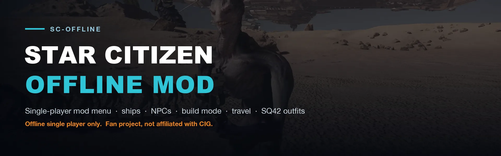
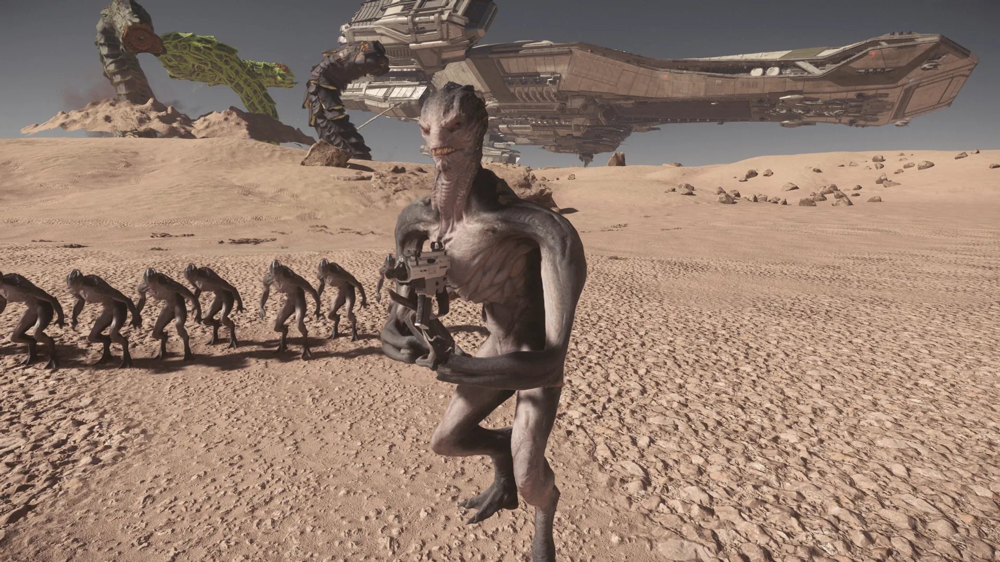

# Star Citizen Offline Mod (ChrisWareOffline)



An offline single-player mod menu for **Star Citizen**. You can spawn ships, NPCs and buildings, teleport around the star systems, and wear Squadron 42 outfits, all from one in-game menu.

> [!WARNING]
> This mod may get your account banned. Use it at your own risk, and **only offline, in single player**.

> [!NOTE]
> Builds from this repository are compiled and checked by CI, but **nobody has played them in game yet**. That includes the current Latest release. If something breaks, see [Troubleshooting](#troubleshooting).



## What you need

- A copy of Star Citizen that you own.
- Windows. Linux through Wine is experimental and untested; see [docs/linux.md](docs/linux.md).
- Easy Anti-Cheat turned off (see [Setup](#setup)).

## Setup

You only do this once.

### 1. Turn off Easy Anti-Cheat

The mod won't run while Easy Anti-Cheat (EAC) is active. While it's off, the game can't join online servers. [Go back online](#go-back-online) reverses these steps.

1. Open PowerShell as administrator and rename the EAC executable:

   ```powershell
   ren "C:\Program Files (x86)\EasyAntiCheat_EOS\EasyAntiCheat_EOS.exe" EasyAntiCheat_EOS.exe.bak
   ```

2. Stop the RSI Launcher from downloading EAC again. Open Notepad as administrator, open `C:\Windows\System32\drivers\etc\hosts`, add this line at the bottom, and save:

   ```text
   127.0.0.1 modules-cdn.eac-prod.on.epicgames.com
   ```

3. Flush the DNS cache with `ipconfig /flushdns`.

### 2. Download the mod

1. Download `sc-offline-<version>.zip` from the newest release on [Releases](https://github.com/scubamount/sc-offline/releases). It's about 1.4 MB.
2. Right-click the zip, choose **Extract All**, and put the folder anywhere, for example your Desktop. Keep all the files together.

Don't copy anything into your game folder. The launcher puts the mod there when you play and takes it out again afterwards.

## Play

1. Close the RSI Launcher and the game.
2. Double-click `sc-offline.exe`. It prints the game folder it found. If Windows asks for administrator rights, say yes. That prompt is for the small helper that copies the mod in and out; the game itself never runs as administrator.
3. Once the game has loaded you in, press **M** to open the menu.

| Key | Action |
| --- | --- |
| `M` | Open or close the menu |
| `F6` | Turn build mode on or off |
| `F7` | Save your position |
| `F8` | Teleport back to the saved position |

The launcher searches every drive for `Roberts Space Industries\StarCitizen`. If it can't find your install, set `game =` in `sc-offline.ini`. The same file also chooses your start ship, the boot map and the channel (`LIVE`, `PTU`, and so on); see [docs/launcher.md](docs/launcher.md).

What's in each menu tab: [docs/features.md](docs/features.md).

## Which DLL do I run?

`sc-offline.exe` copies the `dinput8.dll` that sits next to it, and that's the mod you play. The release zip contains the one CI builds from `src/`. The `dinput8.dll` at the repo root is a different binary: the original author's prebuilt DLL, kept for reference. If you want to swap it in, see [docs/build.md](docs/build.md#the-prebuilt-dll).

## Update

1. Close the game.
2. To keep your money and saved places, copy `wallet.txt`, `spawn.txt`, `bookmarks.txt` and `locations_found.txt` out of the old `data` folder. Copy `sc-offline.ini` too if you changed it.
3. Delete the old folder, then extract the new zip.
4. Put those files back in the new folder.

## Troubleshooting

- **The menu doesn't open:** check that EAC is off and that you started the game with `sc-offline.exe`, not the RSI Launcher.
- **The launcher can't find the game:** set `game =` in `sc-offline.ini`.
- **Is everything set up?** Run `sc-offline.exe status` from a terminal. It checks the DLL, the game version, Easy Anti-Cheat and the hosts file, and changes nothing.
- **The launcher stops with "Easy Anti-Cheat is active":** do [Setup](#setup) step 1 again; a game update can restore `EasyAntiCheat_EOS.exe`.
- **The game crashed or the PC shut down mid-game:** run `sc-offline.exe uninstall` before you play online.
- **A game update broke the mod:** that's expected until the mod is updated for the new game version.
- **Reporting a bug:** send `data/launcher.log`, `data/mod.log`, and the game's `Game.log`.

## Go back online

1. Close the game. Run `sc-offline.exe status`: it should say `Installed: no`. If not, run `sc-offline.exe uninstall`.
2. Rename the EAC executable back, in an administrator PowerShell:

   ```powershell
   ren "C:\Program Files (x86)\EasyAntiCheat_EOS\EasyAntiCheat_EOS.exe.bak" EasyAntiCheat_EOS.exe
   ```

3. Delete the `modules-cdn.eac-prod.on.epicgames.com` line from your hosts file, then run `ipconfig /flushdns`.

## More docs

| Doc | For |
| --- | --- |
| [docs/features.md](docs/features.md) | Every menu tab, including Squadron 42 |
| [docs/launcher.md](docs/launcher.md) | `sc-offline.exe`, `sc-offline.ini`, and what the launcher changes on disk |
| [docs/data-files.md](docs/data-files.md) | The text files in `data/` and the environment variables |
| [docs/linux.md](docs/linux.md) | Running under Wine (experimental) |
| [docs/build.md](docs/build.md) | Building from source, checks, CI and releases |
| [CHANGELOG.md](CHANGELOG.md) | What changed in each release |

## Credits

**ChrisWareOffline** is **Chris Ware**'s mod:

- Source and issue tracker: <https://github.com/trionic1/chrisware-project> (GPL-3.0)
- Upstream Discord: <https://discord.gg/979RRuMjDP>

This repository carries upstream's source (merged through 0.9.0-rc1), the launcher, CI and releases, and the Squadron 42 tab. It is licensed under GPL-3.0; see [LICENSE](LICENSE).

AI was used in a limited way to make this project. It's a fan project, not made by or affiliated with Cloud Imperium Games or Roberts Space Industries. Star Citizen is a trademark of Cloud Imperium Games.
